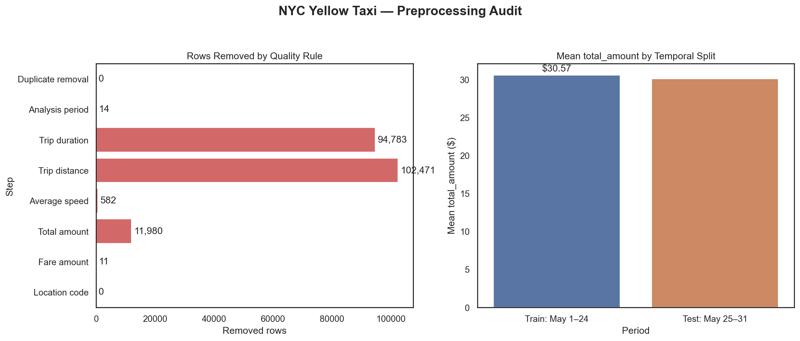
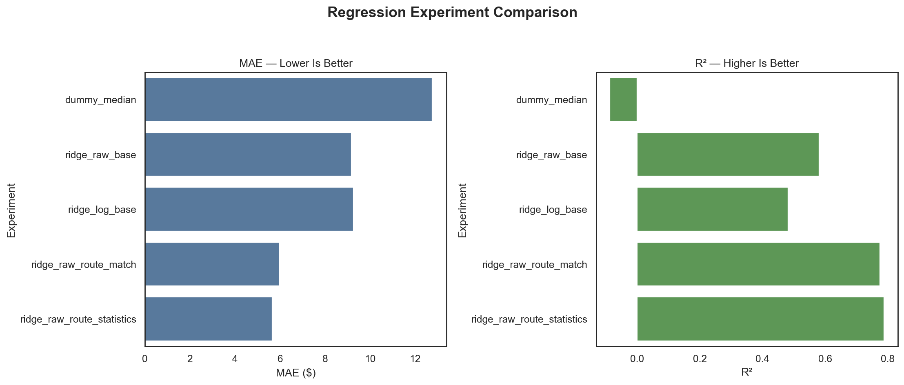
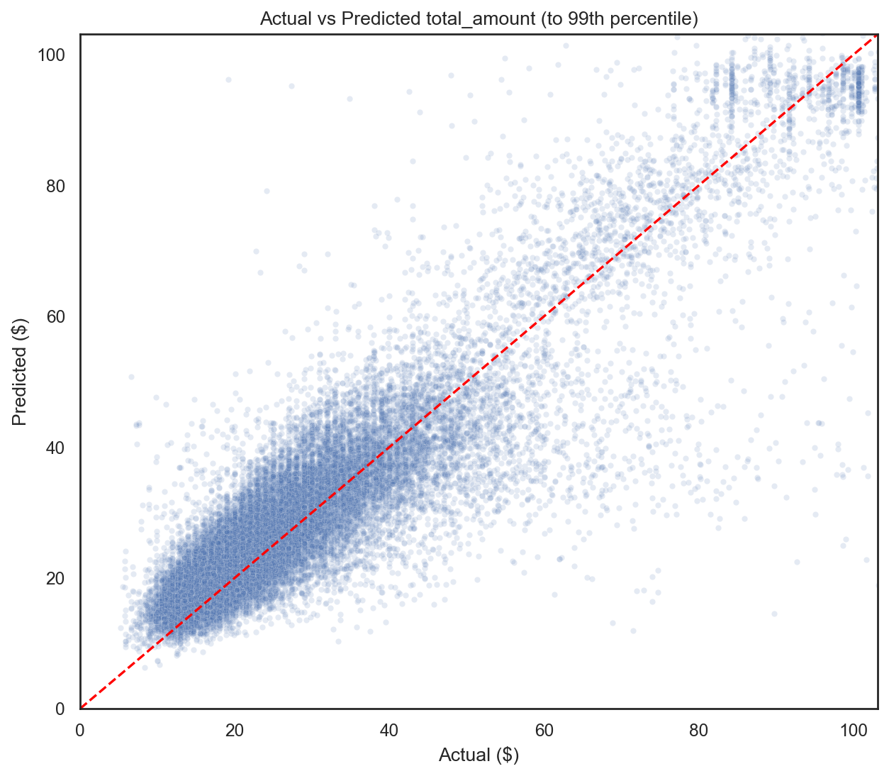
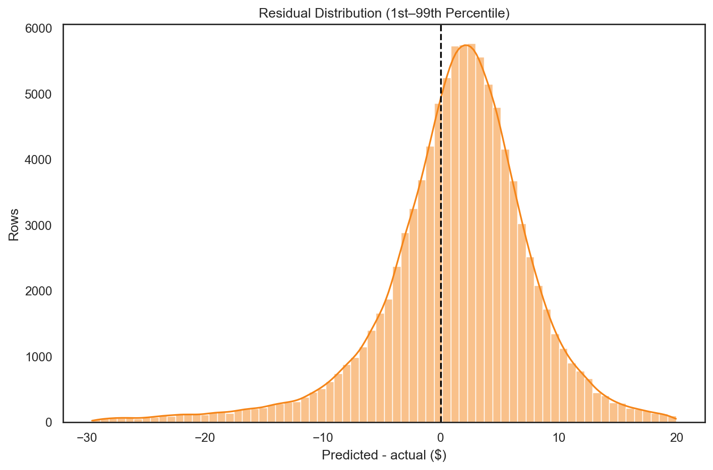
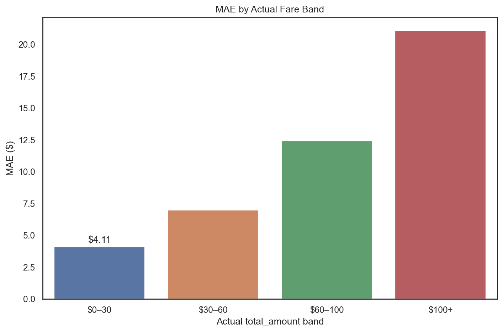
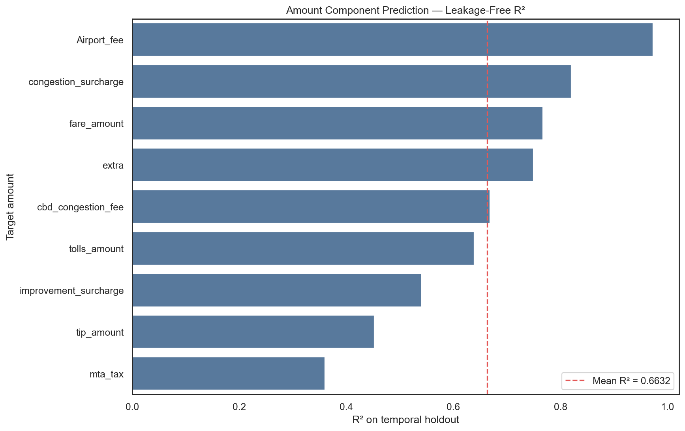
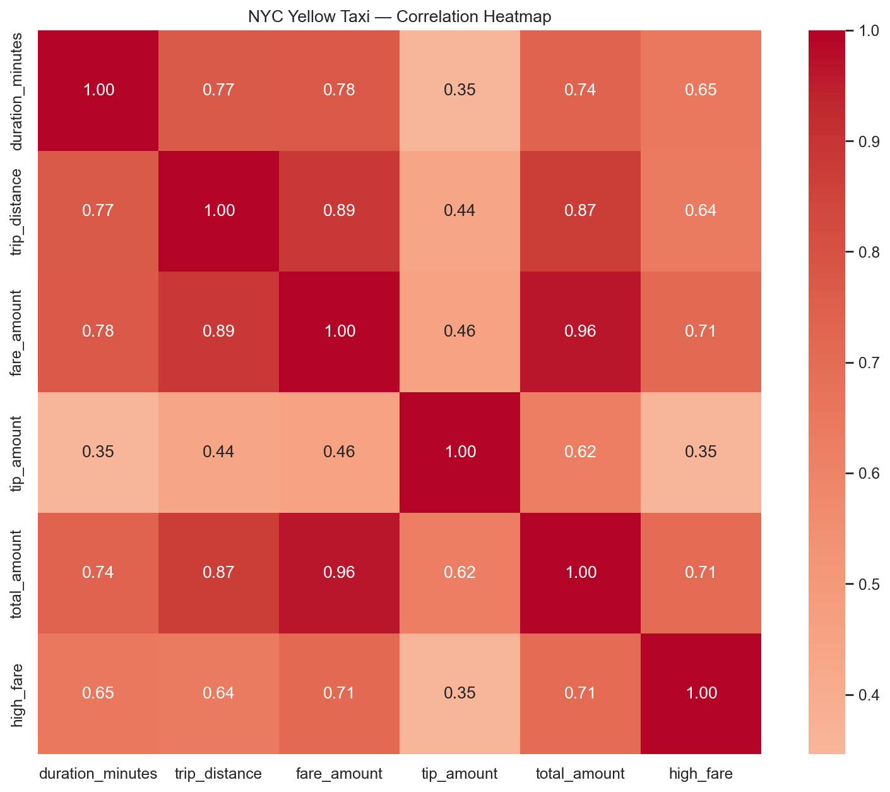

# NYC Yellow Taxi `total_amount` 회귀 분석 보고서

## 1. 문제 정의와 예측 시점

이진 고액 여부 대신 기록된 `total_amount` 자체를 예측한다. 예측 시점은 **승차
직후 목적지 LocationID가 정해진 시점**으로 가정한다. 따라서 승차 시각·승하차
지역·업체·승객 수만 사용하고, 운행 종료 뒤 확정되는 정보는 제외한다.

- 원본: 4,090,836행 × 20열
- 품질 처리 후: 3,880,995행 (94.87% 보존)
- 학습 표본: 400,000행 (5월 1~24일 후보)
- 테스트 표본: 100,000행 (5월 25~31일 후보)
- 테스트 평균/최대 금액: $30.10 / $479.05

## 2. 누수 방지와 전처리

`total_amount`를 직접 구성하는 `fare_amount, extra, mta_tax, tip_amount, tolls_amount, improvement_surcharge, congestion_surcharge, Airport_fee, cbd_congestion_fee`는 모두 삭제했다.
`tpep_dropoff_datetime, trip_distance, payment_type, RatecodeID, store_and_fwd_flag`도 예측 시점에 알 수 없거나 정책 의존성이 커서
제외했다. 이 컬럼을 넣어 얻은 높은 점수는 요금 공식을 재현하는 것이지 사전
예측 성능이 아니다.
거리·소요시간 규칙은 기록 오류를 제거하는 **오프라인 학습 데이터 품질 규칙**일
뿐이며, 온라인 예측 입력이나 모델 피처로 사용하지 않는다.

| 단계 | 규칙 | 제거 행 | 이후 행 |
|---|---|---|---|
| Duplicate removal | 전체 컬럼이 동일한 행 제거 | 0 | 4,090,836 |
| Analysis period | pickup이 2026-05-01 이상, 2026-06-01 미만 | 14 | 4,090,822 |
| Trip duration | 1분 이상 180분 이하 | 94,783 | 3,996,039 |
| Trip distance | 0.1마일 이상 100마일 이하 | 102,471 | 3,893,568 |
| Average speed | 계산 평균속도가 80mph 이하 | 582 | 3,892,986 |
| Total amount | total_amount가 0보다 큼 | 11,980 | 3,881,006 |
| Fare amount | fare_amount가 0 이상 | 11 | 3,880,995 |
| Location code | 승하차 LocationID가 1~265 | 0 | 3,880,995 |

승객 수의 원래 결측 862,544건과
범위 오류 12,024건은 Pipeline
안에서 학습 중앙값으로 대체하고 결측 indicator를 추가했다. 시간·요일은 sin/cos로
변환했다. 테스트의 고액 이상치는 실제 운영 오차를 보기 위해 삭제하거나 상한 처리하지 않았다.



## 3. 데이터 매칭·변형 실험

- `base`: PU와 DO LocationID를 별도 One-Hot 처리
- `route_match`: 기본 PU·DO에 `PU→DO` `route_id`를 추가하고 희소 경로를 묶음
- `route_statistics`: `route_id`와 `route+시간대`의 과거 평균 운임을 TargetEncoder로 추가
- `log`: 긴 오른쪽 꼬리를 줄이도록 `log1p(total_amount)`를 학습하고 달러로 역변환

TargetEncoder는 학습 행에도 5-fold 교차 적합 값을 사용한다. 테스트에는 학습
기간에서 만든 통계만 적용하므로 테스트 정답이 피처에 섞이지 않는다.
경로 통계와 로그 타깃을 함께 쓴 초기 점검에서는 역변환 후 일부 예측이 폭증해
불안정했으므로, 경로 통계 실험은 원금액 Ridge와 조합했다.

| 실험 | MAE | RMSE | Median AE | R² | 학습시간 |
|---|---|---|---|---|---|
| dummy_median | $12.750 | $21.772 | $7.440 | -0.0871 | 0.19s |
| ridge_raw_base | $9.161 | $13.520 | $6.873 | 0.5808 | 0.47s |
| ridge_log_base | $9.251 | $15.039 | $6.169 | 0.4813 | 0.38s |
| ridge_raw_route_match | $5.980 | $9.913 | $4.021 | 0.7746 | 1.64s |
| ridge_raw_route_statistics | $5.647 | $9.613 | $3.868 | 0.7881 | 1.25s |



## 4. 최종 모델과 구간별 결과

MAE가 가장 낮은 `ridge_raw_route_statistics`를 최종 모델로 선택했다.

- MAE: $5.647
- RMSE: $9.613
- Median AE: $3.868
- R²: 0.7881
- 기본 log Ridge 대비 MAE 개선율: 38.96%





| 실제 금액 구간 | 행 수 | 평균 | MAE | RMSE | 평균오차 |
|---|---|---|---|---|---|
| $0–30 | 67,851 | $19.76 | $4.11 | $5.55 | $2.80 |
| $30–60 | 23,594 | $39.81 | $6.99 | $10.55 | $-0.82 |
| $60–100 | 6,887 | $77.86 | $12.43 | $18.14 | $-3.76 |
| $100+ | 1,668 | $116.53 | $21.10 | $36.81 | $-16.97 |



## 5. 요금 구성 항목별 예측

각 항목을 정답으로 바꿀 때도 **모든 요금 구성 컬럼을 입력에서 제외**하고,
`total_amount` 모델과 같은 시간 분할·경로 통계·Ridge 조건을 사용했다. 결측
정답은 임의로 0으로 채우지 않고 해당 항목 학습과 평가에서 제외했다.

```text
--- [항목별 R2 Score 성능] ---
fare_amount: 0.7671
extra: 0.7493
mta_tax: 0.3601
tip_amount: 0.4519
tolls_amount: 0.6388
improvement_surcharge: 0.5404
congestion_surcharge: 0.8201
Airport_fee: 0.9725
cbd_congestion_fee: 0.6685

전체 항목 평균 R2 Score: 0.6632
```

| 정답 항목 | R² | MAE | RMSE | 비영 비율 | 테스트 행 |
|---|---|---|---|---|---|
| fare_amount | 0.7671 | $4.6569 | $8.2258 | 99.99% | 100,000 |
| extra | 0.7493 | $0.6452 | $0.8879 | 44.03% | 100,000 |
| mta_tax | 0.3601 | $0.0066 | $0.0371 | 99.13% | 100,000 |
| tip_amount | 0.4519 | $1.7375 | $2.8661 | 62.05% | 100,000 |
| tolls_amount | 0.6388 | $0.3759 | $1.3254 | 7.00% | 100,000 |
| improvement_surcharge | 0.5404 | $0.0637 | $0.1265 | 96.39% | 100,000 |
| congestion_surcharge | 0.8201 | $0.1505 | $0.3353 | 88.73% | 76,453 |
| Airport_fee | 0.9725 | $0.0113 | $0.0947 | 8.97% | 76,453 |
| cbd_congestion_fee | 0.6685 | $0.1225 | $0.2050 | 65.69% | 100,000 |



R² 평균은 항목별 분산과 단위가 다른 값을 단순 평균한 참고값이다. 특히 대부분
0인 항목은 작은 절대오차에도 R²가 낮거나 불안정할 수 있으므로 MAE·RMSE와
비영 비율을 함께 해석해야 한다.

## 6. 통계 분석

기술통계와 상관계수는 개인 실험의 `metrics/statistical_results.json`에 저장했다.
신용카드와 현금 결제의 이동거리 Welch t-test는 t=-4.068,
p=4.752e-05, Cohen's d=-0.008였다.
p < 0.05지만 효과크기가 거의 0이므로 실질적 차이는 매우 작다.



## 7. 내 모델에 대한 의견과 한계

이진 분류보다 회귀가 금액 크기를 보존해 실제 예상 요금 제시에 더 적합하다.
경로 매칭의 효과는 기본 모델과 동일 홀드아웃에서 직접 비교했으며, 개선율이
양수일 때만 유효한 개선으로 해석했다. 직접 금액 컬럼과 운행 후 거리를 빼도
경로의 과거 통계가 유용한지를 검증한 것이 이 실험의 핵심이다.

다만 목적지가 미정인 길거리 승차에는 이 모델을 그대로 사용할 수 없다. 또한
한 달 자료의 일부 표본으로 평가했으므로 여러 달 rolling holdout이 필요하다.
고액 구간의 행 수가 적어 RMSE가 커질 수 있으며, 평균적인 요금 안내와 고액
이상치 탐지는 별도 모델로 나누는 것이 다음 개선 방향이다.

## 8. 재현과 결과 위치

```bash
python -m src.eda
python -m src.model
```

- 최종 모델: `experiments/kim_yechan/artifacts/models/total_amount_regression_pipeline.joblib`
- 수치 결과: `reports/experiments/kim_yechan/metrics/`
- 그래프: `reports/experiments/kim_yechan/figures/`
- 이전 분류 결과: `reports/experiments/kim_yechan/archive/classification_report.md`
