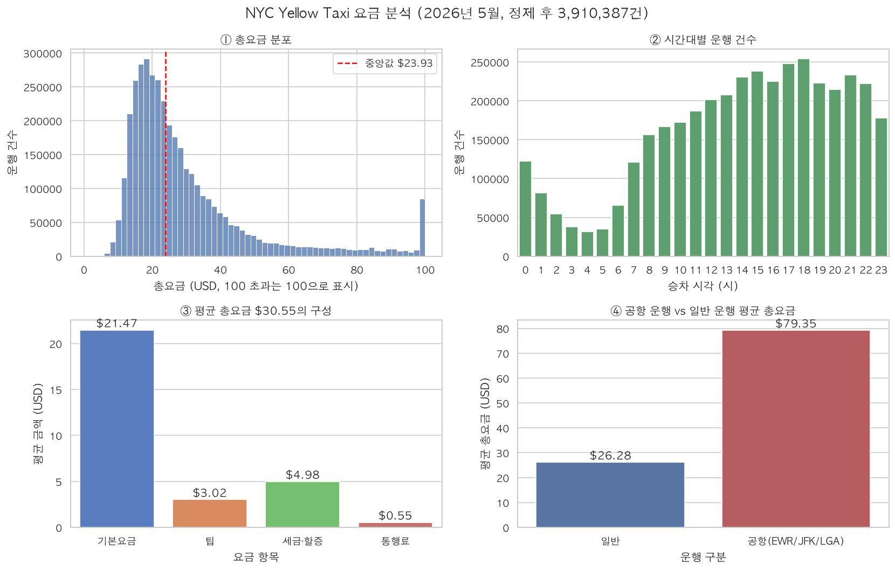
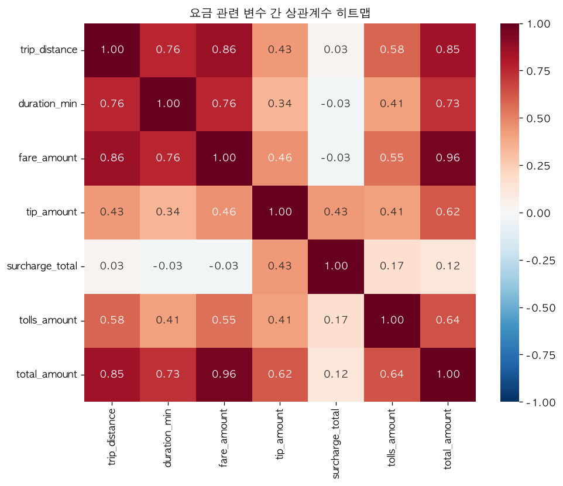

# NYC Yellow Taxi `total_amount` 회귀 분석 보고서 (noh_yeongo)

## 1. 문제 정의와 예측 시점

기록된 `total_amount`(승객 지불 총요금) 자체를 예측한다. 예측 시점은 **승차
직후 목적지가 정해진 시점**으로 가정한다(`pickup_with_known_destination`).
따라서 승차 시각·거리·승객 수·요금제 코드·공항 여부만 사용하고, 운행 종료
뒤에 확정되는 정보(운행시간·요금 구성요소·결제수단·팁)는 모두 제외한다.

- 원본: 4,090,836행 × 20열 (공통 로더가 SHA-256 검증 후 `source_row_id` 추가)
- 공통 분할 유효 행(기간 내 + total>0): 4,075,277행
- 학습: 3,260,221행 → 품질 필터 후 3,128,626행 (96.0% 보존)
- 테스트: **815,056행 전체 예측 (제외 0행)** — 공통 리더보드 기준
- 분할 ID: `random_80_20_full_positive_total_v1` (seed 42)

## 2. 누수 방지와 전처리

`total_amount`를 직접 구성하는 `fare_amount, extra, mta_tax, tip_amount,
tolls_amount, improvement_surcharge, congestion_surcharge, Airport_fee,
cbd_congestion_fee`는 모두 입력에서 제외했다. `duration_min`(하차 후 확정),
`payment_type`(결제 시점 정보)도 제외했다. 공항 여부는 `Airport_fee`(타깃
구성요소)가 아니라 **승·하차 LocationID(1=EWR, 132=JFK, 138=LGA)로 판정**해
간접 누수를 차단했다.

### 2.1 피처 생성 단계 (학습·테스트 동일 적용, 행 삭제 없음)

| 처리 | 규모 | 근거 |
|---|---|---|
| `passenger_count` 결측 → 1 | 955,371행 | 결측 행 = `payment_type=0` 행과 정확히 일치 → 비미터기 수집분의 구조적 결측. 삭제 시 23.4% 손실이라 최빈값 대체 |
| `RatecodeID` 결측 → 99 | 955,371행 | 표준요금(1)으로 위장하지 않고 TLC '미상' 코드로 명시 |
| `trip_distance` 0~100마일 클리핑 | 극단값 소수 | 원본 최대 307,491마일 미터기 오류. 테스트 행은 삭제 불가 → 고정 상한으로 예측 폭주 방어(양쪽 동일 상수 적용, 누수 아님) |
| `is_airport` 생성 (구역 ID) | 전체 | 타깃과 무관한 위치 정보 사용, 결측 행에서도 계산 가능 |
| `pickup_hour`·`pickup_weekday`·`is_weekend` | 전체 | 시간대·요일 요금 패턴 반영 |

### 2.2 학습 품질 필터 (학습에만 적용, 순차 제거)

| 단계 | 규칙 | 제거 행 | 이후 행 |
|---|---|---|---|
| 공통 분할 직후 | — | — | 3,260,221 |
| 거리 클리핑 | >100마일은 100으로 상한(제거 아님) | 0 (109행 상한 처리) | 3,260,221 |
| Fare amount | fare_amount > 0 (환불 레코드 제외) | 1,428 | 3,258,793 |
| Trip distance | 거리 > 0 (미터기 오류·취소 제외) | 88,411 | 3,170,382 |
| Trip duration | 0 < 운행시간 ≤ 180분 | 41,756 | 3,128,626 |

테스트 815,056행에는 이 필터를 적용하지 않았다. 오류 행 포함 실제 운영 조건의
오차를 그대로 평가하기 위함이며, 팀원 간 비교 기준(동일 테스트 집합)을 지키기
위한 공통 규칙이기도 하다.

## 3. 탐색 분석(EDA) 요약

- **구조적 결측**: 5개 컬럼이 동일한 955,371행(23.4%)에서 동시 결측 =
  `payment_type=0` 행 수와 정확히 일치 → 랜덤 결측이 아님을 코드로 증명
- **중복**: 0건
- **이상치**: 요금 ≤ 0 17,182건(최소 -$950, 환불 레코드), 거리 0 113,031건,
  거리 100마일 초과 136건(최대 307,491마일), 운행시간 ≤ 0 52,063건, 180분 초과 1,430건
- **수요·요금 패턴**: 운행 건수는 새벽 4시 최저, 저녁 18시 최고. 평균 요금은
  새벽 5시가 가장 높음(공항행 장거리 비중)



인터랙티브 차트(시간대별 수요 × 평균 요금 이중 축): `figures/plotly_demand_fare.html`

## 4. 성능 — 공통 분할 결과

베이스라인(학습 중앙값 $23.92 상수 예측) 대비 개선 폭으로 모델의 실효성을
평가했다. 테스트 815,056행 전체에 대한 공통 평가 함수 결과이다.

| 모델 | MAE | RMSE | Median AE | R² |
|---|---|---|---|---|
| dummy_median (기준선) | $13.214 | $23.057 | $7.570 | -0.0942 |
| **pickup_time_linear (본 실험)** | **$6.465** | **$11.233** | **$4.304** | **0.7403** |

- 기준선 대비 **MAE 51.1% 개선** — 승차 시점 정보만으로 총요금 분산의 74%를 설명
- 운행의 절반은 오차 ±$4.30 이내 (Median AE)

개발 중 검증 기록: 초기 버전에서 거리 클리핑이 누락되어 테스트의 미터기 오류
행에서 예측이 폭주, **R² -9,608 / RMSE $2,160**이 발생했다. Median AE가 $4.26으로
정상인 점에서 "극소수 행이 평균 지표를 파괴"하는 패턴임을 진단하고 클리핑을
추가해 해결했다. 비정상적으로 나쁜(또는 좋은) 지표는 원인 규명 후에만 채택했다.

## 5. 금액 구간별 성능

| 실제 금액 구간 | 행 수 | MAE | RMSE | Median AE | R² |
|---|---|---|---|---|---|
| $0–30 | 541,434 | $3.95 | $5.75 | $3.30 | -0.188 |
| $30–60 | 201,498 | $9.36 | $12.22 | $7.70 | -1.517 |
| $60–100 | 56,518 | $15.34 | $20.73 | $11.29 | -2.155 |
| $100+ | 15,606 | $24.27 | $44.22 | $11.92 | -0.096 |

- 오차는 금액이 커질수록 증가 — 전체 MAE의 주 원인은 상위 두 구간(테스트의 8.8%)
- 구간 내 R²가 음수인 것은 구간으로 잘라 분산이 좁아지면 "구간 평균 예측"이
  기준이 되기 때문이며, 전체 R² 0.74와 모순되지 않는다. 구간별 해석은 MAE·Median AE 중심으로 한다.

## 6. 요금 구성 항목별 예측

각 항목을 정답으로 바꿀 때도 **모든 요금 구성 컬럼을 입력에서 제외**하고
`total_amount` 모델과 같은 공통 분할·피처·LinearRegression 조건을 사용했다.
결측 정답(비미터기 수집분의 `congestion_surcharge`·`Airport_fee`)은 0으로
채우지 않고 해당 항목의 학습·평가에서 제외했다. `Airport_fee` 예측 시에는
공항 파생 피처(`is_airport`)도 보수적으로 제외했다.

```text
--- [항목별 R2 Score 성능] ---
fare_amount: 0.7389
extra: 0.3870
mta_tax: 0.8566
tip_amount: 0.4316
tolls_amount: 0.4162
improvement_surcharge: 0.2068
congestion_surcharge: 0.6025
Airport_fee: 0.3703
cbd_congestion_fee: 0.1209

전체 항목 평균 R2 Score: 0.4590
```

| 정답 항목 | R² | MAE | RMSE | 비영 비율 | 테스트 행 |
|---|---|---|---|---|---|
| fare_amount | 0.7389 | $4.8350 | $9.2217 | 99.96% | 815,056 |
| mta_tax | 0.8566 | $0.0019 | $0.0213 | 98.73% | 815,056 |
| congestion_surcharge | 0.6025 | $0.1967 | $0.4948 | 88.92% | 623,857 |
| tip_amount | 0.4316 | $1.8197 | $3.0263 | 62.50% | 815,056 |
| tolls_amount | 0.4162 | $0.6789 | $1.6637 | 6.72% | 815,056 |
| extra | 0.3870 | $0.9725 | $1.3671 | 42.52% | 815,056 |
| Airport_fee | 0.3703 | $0.2124 | $0.4684 | 8.13% | 623,857 |
| improvement_surcharge | 0.2068 | $0.0806 | $0.1652 | 96.51% | 815,056 |
| cbd_congestion_fee | 0.1209 | $0.2941 | $0.3325 | 66.25% | 815,056 |

해석: **규칙이 정하는 항목**(미터기 기본요금 0.74, 세율 고정 mta_tax 0.86)은
승차 시점 정보로 잘 예측되지만, **사람이 정하는 팁(0.43)과 경로에 좌우되는
통행료(0.42)**는 절반도 설명되지 않는다. R² 평균(0.459)은 분산·단위가 다른
항목의 단순 평균이므로 참고값이며, 대부분 0인 항목(tolls 6.7%, Airport 8.1%)은
MAE·비영 비율과 함께 해석해야 한다.

## 7. 통계 분석

정제 프레임 3,910,387행 기준. 기술통계(평균/표준편차/분위수): 총요금 평균
$30.55(중앙값 $23.93), 거리 평균 3.52마일(중앙값 1.93) — 오른쪽 꼬리가 긴
전형적 분포로, 짧은 시내 운행이 대다수이고 공항 장거리가 꼬리를 형성한다.

상관계수(Pearson): `trip_distance`–`fare_amount` 0.860, `fare_amount`–`total_amount`
0.960 — 요금의 1차 결정 요인은 거리임을 확인.



Welch t-test (독립표본, `scipy.stats.ttest_ind`, equal_var=False):

| 비교 | 평균 | t | p-value | Cohen's d | 해석 |
|---|---|---|---|---|---|
| 평일 vs 주말 총요금 | $31.13 vs $29.29 | 79.86 | ≈ 0 | 0.085 | p < 0.05로 유의하나 **효과크기가 작아 실질 차이는 제한적** (표본 390만이라 미세한 차이도 유의해짐) |
| 공항 vs 일반 총요금 | $79.35 vs $26.28 | 976.91 | ≈ 0 | **3.300** | 유의하고 효과크기도 매우 큼 — 공항 여부가 요금의 실질적 구분 요인 |

두 검정 모두 p < 0.05로 귀무가설(평균 동일)을 기각하지만, 효과크기를 함께 보면
**모델 피처로서의 가치는 `is_airport` ≫ `is_weekend`**임이 드러난다. 실제로
회귀 계수에서도 같은 순서가 관찰됐다.

## 8. 내 모델에 대한 의견과 한계

이 실험의 목적은 최고 성능이 아니라 **누수 없는 정직한 기준선(baseline) 확보**다.
승차 시점 정보 7개만으로 R² 0.74를 얻었고, 이는 팀의 후속 실험(경로 통계·트리
모델)의 개선 폭을 측정하는 기준이 된다.

한계와 다음 단계:

1. **경로 정보 부재** — 승·하차 구역 조합(263×263)을 쓰지 않아 통행료·우회
   경로를 반영하지 못하며, 고액 구간 오차($100+ MAE $24.27)의 주 원인이다.
   v2에서 교차 적합 방식의 경로 타깃 통계(kim_yechan 실험 방식) 도입 예정.
2. **선형 가정** — 공항 정액제 같은 비선형 구간은 RatecodeID 원-핫으로 부분
   보완했으나, HistGradientBoosting 등 트리 계열로 개선 여지가 있다.
3. **단일 월 평가** — 2026년 5월 한 달 자료의 무작위 분할이므로 계절성·연휴
   효과 검증에는 여러 달 rolling holdout이 필요하다.
4. **테스트 오류 행 포함** — 공통 규칙상 미터기 오류 행도 예측 대상이며,
   클리핑으로 방어했지만 해당 행의 오차는 구조적으로 크다(모든 팀원 동일 조건).

## 9. 재현과 결과 위치

```bash
python -m experiments.noh_yeongo.eda                   # Pandas/Polars 비교 + 품질 진단
python -m experiments.noh_yeongo.visualization         # Seaborn 2x2 + Plotly
python -m experiments.noh_yeongo.statistical_analysis  # 기술통계·상관·t-test
python -m experiments.noh_yeongo.train                 # 공통 분할 학습·평가 (metrics.json 생성)
python -m experiments.noh_yeongo.item_analysis         # 항목별 성능 (item_metrics.json 생성)
```

- 공통 결과: `reports/experiments/noh_yeongo/metrics.json`
- 항목별 결과: `reports/experiments/noh_yeongo/item_metrics.json`
- 그래프: `reports/experiments/noh_yeongo/figures/`
- 모델: `experiments/noh_yeongo/artifacts/models/pickup_time_linear.joblib`
