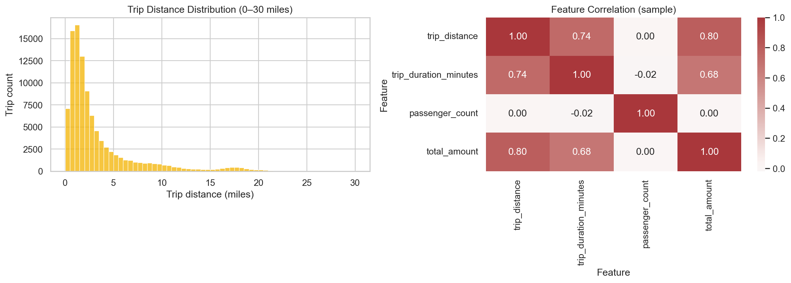
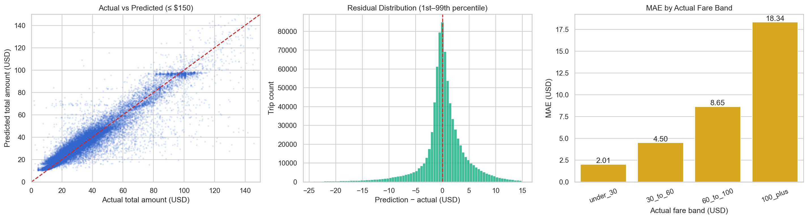

# Final Analysis Results

교수님이 최종 분석 결과를 확인하는 디렉터리입니다. 모든 파일은
`python -m src.final.train`의 실제 실행 결과이며 수치를 수동으로 작성하지
않습니다.

## 권장 확인 순서

1. [`report.md`](report.md) — 분석 과정, 통계 해석, 모델 성능과 한계
2. [`figures/eda_overview.png`](figures/eda_overview.png) — Seaborn 거리 분포·상관 차트
3. [`figures/model_evaluation.png`](figures/model_evaluation.png) — 실제값·예측값·잔차·구간별 오차
4. [`interactive/hourly_total_amount.html`](interactive/hourly_total_amount.html) — Plotly 시간대별 분석
5. [`metrics.json`](metrics.json) — 전체·금액 구간별 모델 지표
6. [`statistical_results.json`](statistical_results.json) — 기술통계·상관·Welch t-test

## 생성 산출물

| 파일                                     | 내용                                   |
|----------------------------------------|--------------------------------------|
| `report.md`                            | 자동 생성 최종 보고서와 본인 의견                  |
| `metrics.json`                         | MAE, RMSE, Median AE, R², 금액 구간별 지표  |
| `descriptive_statistics.csv`           | 평균, 표준편차, 최솟값, 분위수, 최댓값              |
| `correlation.csv`                      | 주요 수치 변수의 Pearson 상관계수               |
| `statistical_results.json`             | Welch t-test, p-value, Cohen's d와 해석 |
| `figures/eda_overview.png`             | Seaborn 정적 분포·상관 차트                  |
| `figures/model_evaluation.png`         | 실제값–예측값, 잔차, 금액 구간별 MAE              |
| `interactive/hourly_total_amount.html` | Plotly 시간대별 평균·중앙값·운행량               |

## 핵심 결과

- 거리–총액 상관: 0.7845
- duration–총액 상관: 0.6632
- 신용카드 vs 현금 Welch t-test: t=108.7091, p<0.05, Cohen's d=0.1948
- 최종 모델: MAE 3.4002, RMSE 7.7800, R² 0.8754

## 수동 제출 체크리스트

1. `python -m src.final.train`의 전체 실행 화면을 캡처합니다.
2. `report.md`에 캠퍼스명·반·이름과 본인 의견을 최종 확인합니다.
3. 보고서와 실행 화면을 PDF로 변환합니다.
4. 5분 발표는 데이터 선택 → EDA → 통계 → 모델 → 한계 순서로 진행합니다.
5. 저장소 전체를 `{캠퍼스}_{반}_{이름}_day2종합실습.zip`으로 압축합니다.
