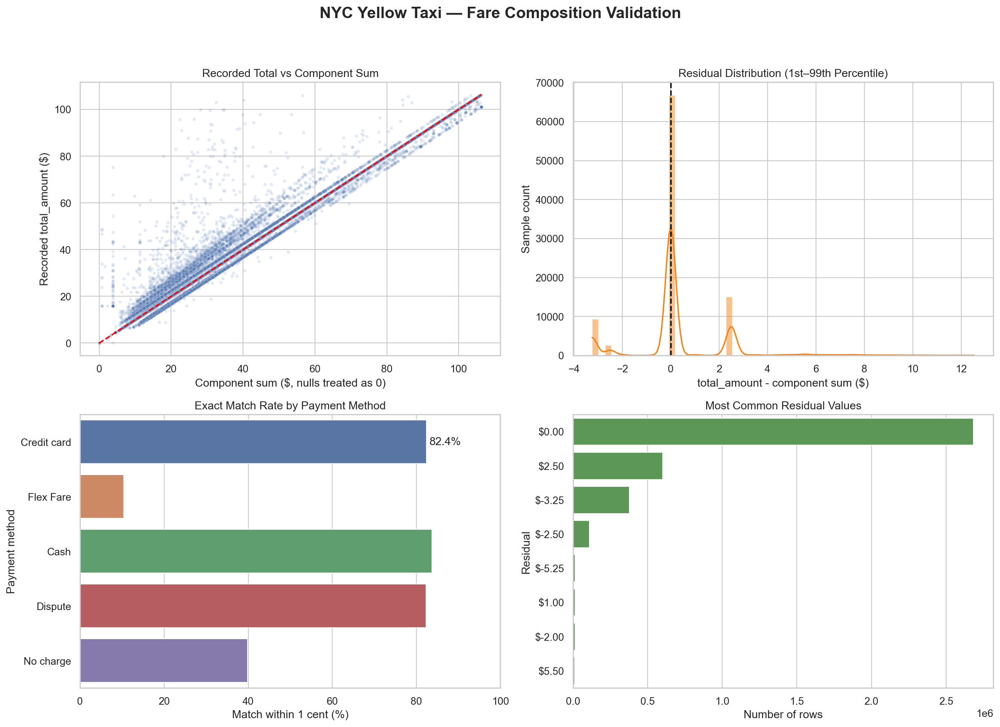
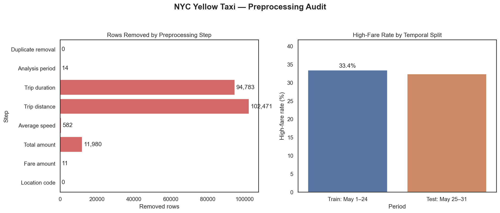
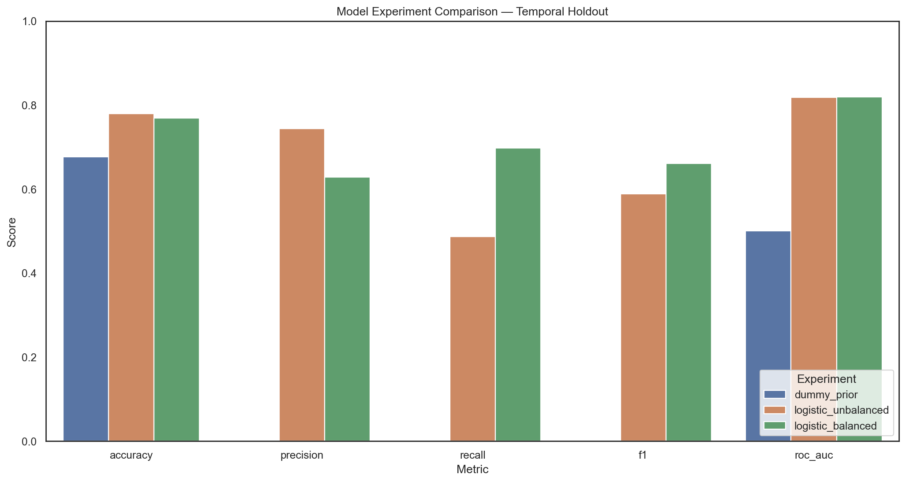
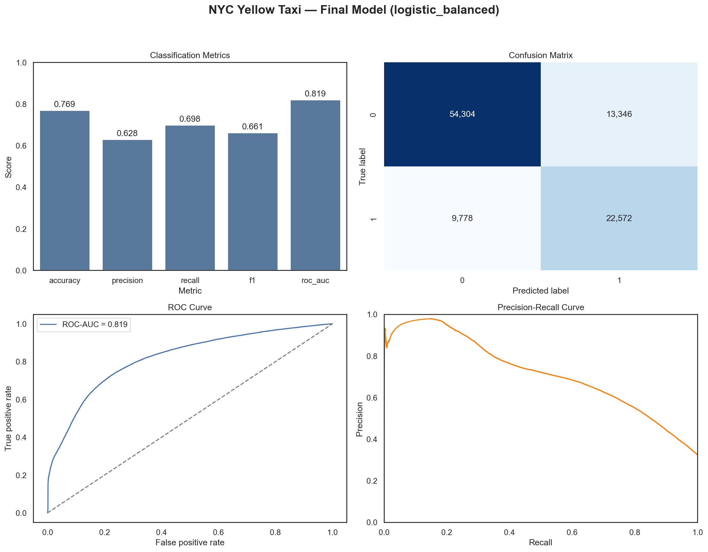

# NYC Yellow Taxi 고액 운행 예측 분석 보고서

## 1. 분석 목적

2026년 5월 NYC Yellow Taxi 기록에서 `total_amount >= $30`을 고액 운행으로
정의하고, 승차 시점에 알 수 있는 시간·지역·공급업체·승객 수 정보로 이를
분류한다. Accuracy뿐 아니라 불균형에 민감한 F1과 ROC-AUC를 함께 평가한다.

## 2. 데이터와 라벨

- 원본: 4,090,836행 × 20열
- 전처리 후: 3,880,995행
- 보존율: 94.87%
- 고액 운행 비율: 33.18%
- 라벨: `high_fare = 1 if total_amount >= 30 else 0`

요금 구성요소를 결측 0으로 합산했을 때 기록된 총액과 1센트 이내 일치율은
65.58%, 평균 절대 오차는
$1.40였다. 따라서 구성요소 합계로
라벨을 재생성하지 않고 기록된 `total_amount`를 사용했다.



## 3. 전처리 실험

| 단계 | 규칙 | 이전 행 | 제거 행 | 이후 행 |
|---|---|---|---|---|
| Duplicate removal | 전체 컬럼이 동일한 행 제거 | 4,090,836 | 0 | 4,090,836 |
| Analysis period | pickup이 2026-05-01 이상, 2026-06-01 미만 | 4,090,836 | 14 | 4,090,822 |
| Trip duration | 1분 이상 180분 이하 | 4,090,822 | 94,783 | 3,996,039 |
| Trip distance | 0.1마일 이상 100마일 이하 | 3,996,039 | 102,471 | 3,893,568 |
| Average speed | 계산 평균속도가 80mph 이하 | 3,893,568 | 582 | 3,892,986 |
| Total amount | total_amount가 0보다 큼 | 3,892,986 | 11,980 | 3,881,006 |
| Fare amount | fare_amount가 0 이상 | 3,881,006 | 11 | 3,880,995 |
| Location code | 승하차 LocationID가 1~265 | 3,880,995 | 0 | 3,880,995 |

승객 수는 품질 필터 후 기존 결측 862,544건에
0명 또는 7명 이상인 12,024건을
추가로 결측 처리했다. Pipeline 내부에서 **훈련 데이터 중앙값**으로 대체하고
결측 indicator를 추가해 값 대체와 결측 패턴을 구분했다.

시간과 요일은 경계가 이어지는 주기형 특성을 반영하기 위해 sin/cos로 변환했다.
`total_amount`와 9개 요금 구성요소, 거리, 하차시간, 결제수단은 정답 누수를
막기 위해 모델 입력에서 제외했다.



## 4. 통계 분석

Welch t-test로 신용카드와 현금 결제의 평균 이동거리를 비교했다.

- 신용카드 평균: 3.440마일
- 현금 평균: 3.474마일
- t 통계량: -4.068
- p-value: 4.752e-05
- Cohen's d: -0.008

p < 0.05이므로 평균 차이는 통계적으로 유의하지만, 대규모 표본에서는 작은
차이도 유의해질 수 있으므로 효과크기와 인과관계를 별도로 고려해야 한다.


## 5. 실험 설계

랜덤 분할 대신 2026-05-25 이전을 학습 후보, 이후를
테스트 후보로 분리했다. 시간 순서를 보존한 상태에서 라벨 비율을 유지해
학습 400,000행, 테스트
100,000행을 표본 추출했다.

비교 모델은 다수 클래스 기준선, 일반 Logistic Regression, `class_weight`로
불균형을 보정한 Logistic Regression이다. 모든 Logistic 모델은 동일한
ColumnTransformer와 시간 홀드아웃을 사용했다.

| 실험 | Accuracy | Precision | Recall | F1 | ROC-AUC | 학습시간 |
|---|---|---|---|---|---|---|
| dummy_prior | 0.6765 | 0.0000 | 0.0000 | 0.0000 | 0.5000 | 0.20s |
| logistic_unbalanced | 0.7798 | 0.7441 | 0.4868 | 0.5886 | 0.8185 | 0.51s |
| logistic_balanced | 0.7688 | 0.6284 | 0.6977 | 0.6613 | 0.8191 | 0.53s |



## 6. 최종 모델과 결과

F1이 가장 높은 `logistic_balanced`를 최종 모델로 선택했다.

- Accuracy: 0.7688
- Precision: 0.6284
- Recall: 0.6977
- F1: 0.6613
- ROC-AUC: 0.8191



## 7. 모델에 대한 의견과 한계

기준 모델과 비교해 실제 분류 신호가 있음을 확인했으며, 지역과 시간 정보만으로
고액 운행 가능성을 어느 정도 구분할 수 있었다. 구성요소 합계를 입력하면 높은
점수를 쉽게 얻을 수 있지만 이는 예측이 아니라 정답 공식의 재현이므로 제외한
현재 결과가 더 정직한 성능이라고 판단한다.

다만 한 달 데이터의 50만 표본만 학습했고, 목적지가 승차 시점에 알려진다는
가정으로 `DOLocationID`를 사용했다. 계절 변화와 목적지 미확정 상황에는 성능이
달라질 수 있다. 또한 공식 최대요금 근거가 없어 500달러 초과 28행을 임의로
삭제하지 않았으며, 이진 라벨 특성상 금액 크기는 학습 입력에 포함되지 않는다.
다음 개선은 여러 달 시간 홀드아웃, 임계값 튜닝, 트리 기반 모델 비교 순으로
진행하는 것이 적절하다.

## 8. 재현 방법

```bash
python -m src.eda
python -m src.model
```

수치 결과는 `reports/metrics/`, 그림은 `reports/figures/`, 학습 모델은
`models/high_fare_pipeline.joblib`에 저장된다.
